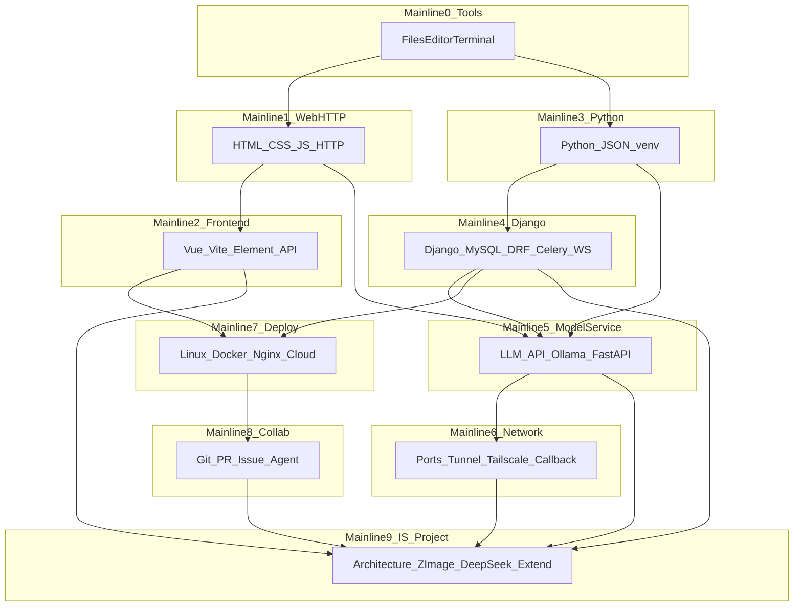

# Intelligence Space Lab 课程设计规范

本文档是 **Intelligence Space 新人训练仓（Lab）** 的课程设计规范与 **多主线技术进阶地图**。它解决两件事：**教什么、按什么顺序教**（路径深度），以及 **用什么形态教**（卡片教程 + 本地练习包 + 验收）。后续编写关卡、评审 PR、Agent 生成内容时，应以此为准。

---

## 1. 本规范为什么要重写

早期版本用 **A–F 六个粗阶段**（如「零基础 → 网页 → Python → HTTP → 大模型 → 主项目」）描述方向，存在明显不足：

1. **技术路线过粗**：看不出每条技术栈如何从 0 走到可参与项目。  
2. **跨度过大**：容易隐含「学完 Python/HTTP 就能理解大模型与 Intelligence Space 架构」的不合理跳跃。  
3. **缺少分线**：真实学习路径是 **网页与 HTTP → 三件套 → Vue 工程 → Python → Django/MySQL → Redis/Celery → 模型 API/Ollama → FastAPI 模型服务 → 端口与隧道/内网 → Linux/Docker/Nginx/云上部署 → Git 协作 → 主项目综合**，不能压成一条粗线。  
4. **与项目技术栈脱节**：未系统体现 Vue、Element Plus、Django、DRF、MySQL、Redis、Celery、Channels/WebSocket、FastAPI、uvicorn、Ollama、端口暴露、FRP/Tailscale、Docker、Nginx、双仓库与 Control Plane 等 **渐进出现** 的顺序。  
5. **对 Agent 指导不足**：粗阶段无法约束「这一关是否跳步、前置是否满足、主项目映射是否过早」。

因此本规范 **推翻仅 A–F 的粗划分**，改为 **多条技术主线 + 综合项目线**，每条线具备 **「零基础 → 小 Demo → 与主项目映射」** 的逐级展开；同时 **保留** 已验证的教学形态（网页卡片 + 练习包 + `START_HERE.html` + 验收清单）。

---

## 2. Lab 的真实目标

- **首要目标**：让准备进入 Intelligence Space 相关开发的新人，能沿 **清晰、可执行** 的路径补齐技能，而不是读完一篇「大方向」仍不知道下一关学什么。  
- **形态目标**：每一关尽量 **先用浏览器讲清概念**（卡片教程），再 **用最小本地练习包动手**（含网页式步骤 `START_HERE.html`），并有 **可观察的验收与提交物**。  
- **路径目标**：对齐 **真实项目演进方式**——从登录注册、单表、接口，到异步任务与 WebSocket，再到模型服务、网络可达性、部署与协作，最后才收束到 **双仓库架构、adapter、extension、scheduler、Control Plane、新模型接入与 Agent 协作**。  
- **非目标**：替代正式项目文档；在零基础前几关 **不** 把主仓库架构当作必读负担。

---

## 3. 核心教学形态：卡片教程 + 本地练习包 + 验收清单

以下原则 **继续有效**，并作为全仓统一形态：

| 组成部分 | 职责 | 说明 |
|----------|------|------|
| **网页卡片教程** | **教** | `demo/index.html`（或同关静态页）：卡片化、图文、轻互动、小测、即时反馈；尽量降低安装与终端依赖。 |
| **本地练习包** | **练** | `practice/starter/`：最小文件集；**必须**含 `START_HERE.html`（逐步：解压、打开编辑器、改哪个文件、保存、刷新/运行、常见错误）；**必须**有 `README.md` 作索引，但 **不能仅靠 README**。 |
| **验收清单** | **验** | `checklist.md`：新人自检、提交物、负责人验收项；`exercises.md`：变式与加分练习。 |

其他约定：

- **不要求**新人第一天 **clone 整个仓库**；优先 **本关最小练习包 ZIP**（`practice/package.zip` 可由发布流程生成，与 `starter/` 同步）。  
- 卡片页可提供 **「下载本关练习包」** 入口；全仓 ZIP 仍可作为完全零基础的获取方式之一。  
- **不强制**引入 Webpack/Vite 等重型构建作为「全关默认前提」；某关需要时再声明，且须满足该关所属主线的 **前置**（见第 20 节）。

---

## 4. 每一关的标准结构

推荐每一关在仓库中采用如下结构（与实现进度可渐进对齐）：

```text
levels/xx-topic/
  README.md                 # 本关目标、前置知识、与主线/主项目的映射（不堆过长架构）
  demo/
    index.html              # 网页卡片教程（必备，除非本关纯练习包且卡片合并到别处——例外须评审）
    ...                     # 卡片用静态资源（可选）
  practice/
    starter/
      START_HERE.html       # 练习包内网页式教程（本地实践关必备）
      README.md
      ...
    answer/                 # 参考答案（可选，默认不放入下发 zip）
    package.zip             # 下发用压缩包（由 CI/脚本生成，可选）
  exercises.md
  checklist.md
  assets/                   # 示意图、截图占位（可选）
```

每一关 `README.md` **必须**写清：**本关属于哪条主线**、**前置必须完成哪些关/哪些能力**、**学完后能独立完成什么**。

---

## 5. 本地练习包的标准结构

`practice/starter/` 至少包含：

1. **`START_HERE.html`**：主学习路径；默认新人 **不会** VS Code/PyCharm、不会终端、不懂工作目录。  
2. **`README.md`**：文件清单、与卡片教程的链接、补充说明。  
3. **本关所需最小源码/配置**（如 `*.html`、`*.py`、`requirements.txt` 片段等）。

`START_HERE.html` 建议覆盖的叙述点：这一包是做什么的；要装什么软件；如何解压；如何用编辑器 **打开文件夹**；每一步改哪个文件；改前/改后对比；如何运行或刷新验证；常见错误；提交截图与说明的要求。

---

## 6. 为什么不能一上来 clone 整个仓库

- 零基础新人的认知负荷在 **「找到文件、解压、双击、保存」**；clone 涉及 Git 安装、认证、路径概念，**易在第一天耗尽耐心**。  
- 全仓体积与目录结构对新人 **信号噪声比低**，不利于「只完成当前一步」。  
- **练习包**能把「当前关需要的文件」压到最小，便于验收与自动化检查。

因此：**默认推荐 ZIP / 单关练习包**；全仓 clone 放在 **主线 8** 与团队流程成熟后再强制。

---

## 7. 为什么不能一上来讲任务状态、调度器和主项目架构

- **任务状态、队列、调度器** 建立在 **HTTP/API、异步执行、前后端分工** 已有直觉之后，否则只是名词堆砌。  
- **Control Plane、双仓库、adapter/extension 全景** 需要新人已接触过 **后端路由、模型 HTTP 服务、端口与回调** 等具体经验，否则无法建立 **可验证的心智模型**。

允许在极早期用 **一页卡片** 展示「任务状态长什么样」（类比 UI），但 **不得** 把 scheduler、Control Plane 实现细节、多服务拓扑作为 **前几关的必修门槛**。

---

## 8. 多主线课程地图总览

Lab 采用 **多条技术主线并行定义、按依赖顺序串关** 的方式组织。**禁止**用少数粗阶段替代下列主线中的任一条的「逐级课题」设计。

| 编号 | 主线名称 | 一句话目标 |
|------|----------|------------|
| 0 | 工具与电脑基础 | 会用文件、浏览器、编辑器、终端与提交物 |
| 1 | 网页与网络基础 | 理解网页构成与 HTTP/URL/请求响应/Network |
| 2 | 前端工程路线 | 三件套 → Vue 工程 → 组件/路由/状态 → Element Plus → 对齐项目前端概念 |
| 3 | Python 与后端基础 | 语言与 JSON/文件/虚拟环境，为脚本与后端框架打底 |
| 4 | Django / 后端工程路线 | 最小 Django → ORM/MySQL → DRF → 业务接口 → Redis/Celery/WebSocket/Artifact |
| 5 | 大模型与模型服务路线 | 模型概念 → curl/Python 调 API → Ollama/小模型 → FastAPI/uvicorn → health/execute/stream |
| 6 | 网络、端口与内网通信路线 | localhost/监听/暴露 → 隧道与风险 → Tailscale 等 → callback 与跨机调用直觉 |
| 7 | 部署与基础设施路线 | Linux/SSH → Docker/compose → Nginx 反代 → 构建物与日志 → 云上对齐 |
| 8 | Git / Gitee / 协作路线 | 仓库与分支 → PR/review → Issue 与 Agent 协作规范 |
| 9 | Intelligence Space 综合项目路线 | 在以上基础具备后，再讲清双仓库、Control Plane、调度与接入全流程 |



上图表示 **依赖大势**：具体关卡可在 `docs/01-learning-routes/` 中拆为可并行支线（如仅前端成员加强 M2）；**M9 必须最后收束**。

---

## 9. 主线 0：工具与电脑基础

**目标**：新人能独立使用训练营材料完成「打开—修改—保存—验证—提交」。

应覆盖（拆为多关小步，非一页说完）：

- 文件、文件夹、压缩包、解压；**路径**是什么（绝对/相对、当前文件夹）。  
- 浏览器是什么；多标签与本地文件（`file://`）打开方式。  
- **VS Code / PyCharm 是什么**；如何 **打开文件夹**（而非只打开单个文件）；保存、查找。  
- 如何 **刷新浏览器** 看到修改效果。  
- **终端是什么**；命令在 **哪个目录** 执行；如何确认当前目录。  
- 如何 **复制报错**、如何 **截图**、按清单 **提交**。

**要求**：本主线 **不得** 默认新人会使用编辑器或终端；后续所有关的 `START_HERE.html` 须与本主线能力对齐或显式复习。

---

## 10. 主线 1：网页与网络基础

**目标**：在进入 Vue、后端 API、模型 HTTP 之前，建立网页与 HTTP 世界的基本心智。

应覆盖（多关递进）：

- 什么是网页；**HTML / CSS / JavaScript** 各管什么。  
- **DOM**、点击事件、输入框、简单交互。  
- **URL**：协议、域名、IP、**端口**、路径、查询参数。  
- **HTTP**：请求、响应、**请求头**、**请求体**、**状态码**。  
- **JSON** 响应形态与浏览器中的展示。  
- **开发者工具**、**Network 面板**（看请求与响应）。  
- 可选：**最小「网页请求」或爬虫体验」**（仅合法、教学用目标），巩固 URL 与请求头概念。

**要求**：本线是 **主线 2、4、5** 的共同前置中的「Web/HTTP 侧」；**不能**用「已会 Python」跳过 Network 与 URL。

---

## 11. 主线 2：前端工程路线

**目标**：从网页三件套 **逐步** 过渡到 Vue 工程化与组件生态，再映射到 Intelligence Space 前端常见模块。

**硬性顺序**：**必须先** 完成主线 1 中三件套与 HTTP/fetch 基础，**再** 进入 Vue；**禁止**零基础直接 Vue。

应覆盖（多关、每关可验收）：

- **Node.js**、**npm**、**Vite**（何时需要、如何跑 dev）。  
- **Vue 项目结构**；`template` / `script` / `style`。  
- **ref / reactive**、事件绑定、**列表/条件渲染**。  
- **props / emit**、**生命周期**、**watch / computed**。  
- **组件拆分**、**路由**。  
- **API 封装**（与主线 1 的 fetch 衔接）。  
- **Element Plus**、**ElMessage**、表单、**聊天框 UI**、**进度条**、文件/图片 **预览**。  
- **前端状态管理**（从组件 state 到必要时 Pinia 等，按项目实际选型递进）。

**映射到项目（后期关）**：chat 页面、message 与 adapter 概念、事件路由、模型列表、artifact 预览、进度展示等——须在 **Vue 与 API 封装过关后** 专题出现，且 **写清对应仓库路径/模块名**（由 `docs/02-project-mapping/` 维护明细）。

---

## 12. 主线 3：Python 与后端基础

**目标**：为 Django、FastAPI、模型侧脚本、自动化与验收脚本打牢语言与运行环境基础。

应覆盖：

- Python 安装与解释器、`print`。  
- 变量、条件、循环、**函数**。  
- **list / dict**、**JSON** 与 Python 类型的对应。  
- **读文件**、路径、`encoding`、**异常处理**。  
- **虚拟环境**、**pip**、**requirements.txt**。  
- 最小可运行脚本、命令行参数（可选）。

**要求**：**禁止**在未完成本主线核心内容前，用 Django 或 FastAPI 作为「第一门后端课」。

---

## 13. 主线 4：Django / 后端工程路线

**目标**：沿真实项目成长路径，从最小 Django 到与 Intelligence Space 后端主链路对齐的概念与练习。

**硬性顺序**：**Python 基础（主线 3）** 完成后，再系统进入 Django；**HTTP/JSON（主线 1）** 有助于理解视图返回 JSON，可与 Django 早期关交叉引用。

应覆盖（逐级加复杂度）：

- 创建最小 Django 项目；**路由**、**视图**、返回 **JSON**。  
- **登录/注册**、用户模型。  
- **MySQL** 连接、迁移、**ORM**。  
- **Django REST Framework**：Serializer、**APIView / ViewSet**、**鉴权**。  
- **模型配置表**、模型列表接口、执行类接口等 **与业务域相关的最小复刻**（字段命名与主项目对齐须在映射文档中定义）。  
- 领域概念（按主项目实际演进引入）：**ChatSession**、**ChatMessage**、**ExecutionTask** 等——**须在 ORM 与 REST 基础关之后**，分关出现。  
- **Redis**、**Celery**、异步任务、任务状态与后台执行。  
- **Channels / WebSocket**（或项目等价方案）、**Artifact 保存**、**messages fallback** 等——在「同步 API + 任务」建立后再引入。

**要求**：体现「项目不是一开始就有复杂架构」，而是 **登录注册 → DB → 接口 → 异步 → 实时与 artifact** 长出来；每关写清 **与主项目后端模块的映射**（不一次性灌输全架构）。

---

## 14. 主线 5：大模型与模型服务路线

**目标**：独立建立「模型端」能力：从会调用一个模型，到理解 **模型服务** 与平台化接入（adapter、callback、streaming 等）。

**硬性顺序**：**Python（主线 3）** + **HTTP/API/curl（主线 1）** 之后，再系统引入大模型与 Ollama；**禁止**在 Python/HTTP 之前把 Ollama 当第一课。

应覆盖：

- 什么是大模型；**Prompt**、**Token**、输入输出形态。  
- **API Key**、安全与泄漏风险（概念关）。  
- **curl** 调模型 API、**Python** 调模型 API。  
- **Ollama**、本地 **小参数量级（如 1.5B）** 模型体验。  
- **Hugging Face** 基础概念与模型获取（合规、资源说明）。  
- **显存/内存** 基本概念、本地运行失败常见原因。  
- **Ollama HTTP API**。  
- **FastAPI** + **uvicorn** 作为 **模型网关**：**`/health`**、**`/execute`**、**`/stream`** 等契约。  
- **adapter**、**callback**、**streaming**、模型注册等 **与主项目模型侧一致的术语**——在「单服务可调通」之后再引入。  
- 真实服务示例关：**ZImage**、**DeepSeek** 等（与 `docs/02-project-mapping/` 一致）。

---

## 15. 主线 6：网络、端口与内网通信路线

**目标**：回答「为什么本地模型别人调不到」「后端如何找到模型端」「callback URL 为何重要」，从端口到隧道再到内网方案。

应覆盖：

- **localhost**、**127.0.0.1**、**局域网 IP**。  
- **端口监听**、本机访问 vs 外网访问。  
- **端口暴露**、**防火墙** 基本概念。  
- **ngrok** 是什么（可说明教学场景与局限性）。  
- **FRP** 是什么、**公网暴露风险**（扫描、滥用）。  
- **Tailscale**（或团队采用的等价方案）是什么、**为何内网通信更安全**、与「不开放业务网页端口」的取舍。  
- **腾讯云服务器** 与 **DGX/本地模型机** 如何协同的 **概念模型**（可与架构图配合）。  
- **backend 调用模型端**、**Control Plane 发现 backend**、**callback URL**——须在 **模型 HTTP 服务可调通** 之后，且 **主线 9** 收束前分关讲清。

**要求**：**禁止**在本主线之前用 Control Plane 替代「端口与可达性」直觉。

---

## 16. 主线 7：部署与基础设施路线

**目标**：让未接触过 Linux 的新人能把服务从本机推到「类生产」环境，并对日志与重启有基本手感。

应覆盖：

- **Linux** 基本命令、目录、权限入门。  
- **SSH**、远程登录、**进程**、**端口**、**日志**查看。  
- **Docker**、**Dockerfile**、**docker compose**；MySQL/Redis 等容器与网络。  
- **Nginx**：**反向代理**、静态资源、**WebSocket 代理**（与主线 4 衔接）。  
- 前端 **build** 产物部署、后端 **ASGI/WSGI** 进程、**服务重启**与排错。  
- **腾讯云**（或团队指定云）上的部署路径与 **intelligence-space 的 compose/拓扑** 对齐（由映射文档细化）。

**要求**：Docker 之前须有 **Linux/SSH 入门关**；Nginx 须在「能本地/容器跑起前后端」之后再合并反代关。

---

## 17. 主线 8：Git / Gitee / 协作路线

**目标**：从不会 Git 过渡到能 **Issue / 分支 / PR / Review** 参与协作，并理解 Agent 辅助下的工作流。

应覆盖：

- 仓库是什么；**download ZIP** 与 **clone** 的差异与选用场景。  
- `git clone`、**branch**、`status`、`add`、`commit`、`push`、`pull`。  
- **Pull Request**、**review**、**merge**、**conflict** 解决。  
- **Issue**、标签、里程碑；**Agent 接 Issue**、人类验收（与团队规范对齐）。  
- **主项目禁止直接 push**、**一 Issue 一分支** 等团队规则（以主仓库 CONTRIBUTING 为准）。  
- 学习成果与练习的 **提交方式**（PR 到 Lab 仓或指定位置）。

**要求**：**禁止**在主线 0 未过关时 **强制** 全团队以 clone 作为唯一入口；本主线可在 **中后期** 集中强化。

---

## 18. 主线 9：Intelligence Space 综合项目路线

**目标**：在各主线具备 **最低可运行基础** 后，再系统讲清 **为何** 需要当前架构，以及 **一次任务如何贯穿各端**。

应覆盖（分多关，每关可验收小切片）：

- 为什么 **前端不宜直接调模型**（密钥、计费、策略、统一接入）。  
- 为什么需要 **后端**、**模型服务**、**Control Plane**。  
- **adapter**、**extension**、**queue**、**scheduler**、**artifact 双线**、**WebSocket**、**messages fallback** 各解决什么问题。  
- **一次 ZImage 任务** 从发起到 artifact 的链路；**一次 DeepSeek 流式** 链路。  
- **双仓库** 结构、前端/后端/模型端 **边界**。  
- **新模型接入** 要动哪些层、**统一字段** 的原因。  
- **Agent** 适合做什么、人类必须验收什么（与主线 8 衔接）。

**要求**：**禁止**在主线 2/4/5 未建立基础前，用本主线替代「语言与框架课」；本主线以 **综合、对照、走读代码** 为主，仍应配合 **小步 runnable Demo**。

---

## 19. 推荐的新人学习顺序

以下顺序表示 **默认全栈新人** 的 **依赖优先** 路径；**不同角色可裁剪**（仅前端可强化 0→1→2 后提前更多 Vue 关；仅模型端可强化 0→3→1→5→6；运维强化 0→7→6；等）。

```text
工具与文件基础（主线 0）
  → 网页和浏览器基础 + URL/HTTP/Network（主线 1）
  → HTML / CSS / JavaScript 与最小交互（主线 1）
  → Python 基础 + JSON + 文件 + 虚拟环境（主线 3）
  → HTTP/API 基础巩固（与主线 1 后半呼应）
  → 前端：Vue 路线（Node/npm/Vite → Vue → 路由/状态 → Element Plus）（主线 2）
  → 后端：Django 路线（最小项目 → MySQL/ORM → DRF → 业务域接口）（主线 4）
  → 数据库 / Redis / Celery / WebSocket 与 artifact（主线 4 后半）
  → 模型：API 概念 → curl/Python → Ollama/小模型（主线 5）
  → FastAPI + uvicorn 模型服务与契约（主线 5）
  → 网络：端口、暴露、FRP、Tailscale、callback（主线 6）
  → 部署：Linux → Docker → Nginx → 云上前后端（主线 7）
  → Git/Gitee/Issue/PR/Agent 协作（主线 8）
  → Intelligence Space 双仓库架构与全链路、新模型接入（主线 9）
```

**角色化说明**（在 `docs/01-learning-routes/` 中应展开为可选路径表）：

- **前端成员**：0 → 1 → 2（加深）→ 4/5 中选「读懂接口与任务状态」所需最少量 → 9 中前端相关切片。  
- **后端成员**：0 → 1（HTTP）→ 3 → 4（加深）→ 5/6 所需最少量 → 9。  
- **模型端成员**：0 → 3 → 1（HTTP）→ 5（加深）→ 6 → 7 所需最少量 → 9。  
- **部署/运维**：0 → 1（网络基础）→ 7 → 6 → 8 → 9 中运维相关切片。

---

## 20. Agent 生成课程时的硬性规则

1. **不能只写 README** 作为新人唯一教程；必须配合 **卡片 `demo/index.html`** 和/或 **`START_HERE.html`**。  
2. **每一关**须有 **`demo/index.html`** 卡片教程（除非评审批准的极少数例外，且须在 PR 说明理由）。  
3. **需要本地动手实践的关**，**必须**有 **`practice/starter/START_HERE.html`**。  
4. **练习包**不得默认新人会 VS Code/PyCharm/终端；步骤须显式写出。  
5. **Git/Gitee** 不得作为 **第一天强制** 唯一获取方式；须支持 ZIP/练习包。  
6. **Ollama / 大模型 API** 不得放在 **Python 与 HTTP/API 基础** 之前。  
7. **Vue** 不得放在 **HTML/CSS/JS 与必要 HTTP 基础** 之前。  
8. **Django** 不得放在 **Python 基础** 之前。  
9. **Control Plane / Scheduler 全架构** 不得放在 **模型 HTTP 服务、端口与回调** 直觉建立之前作为必修主线。  
10. **每关必须**写清 **前置知识**（依赖哪些关/哪些主线能力）。  
11. **每关必须**有 **提交物**（截图/说明/可选代码）。  
12. **每关必须**有 **验收标准**（`checklist.md`）。  
13. **每关必须**写清与 **主项目的关系**，但 **禁止** 在零基础前几关 **堆全文架构**；用「本关只映射这一块」的方式递进。

---

## 21. 后续需要单独拆分的文档

以下内容 **不宜** 全部挤在本规范中，建议在 `docs/` 下 **单独维护**（本规范引用其职责）：

| 文档（建议路径） | 职责 |
|------------------|------|
| `docs/01-learning-routes/` | **关卡依赖图**、周次/里程碑、**角色可选路径**（前端/后端/模型/运维裁剪表）。 |
| `docs/02-project-mapping/` | **每一关 ↔ 主仓库路径/模块/术语** 对照表；Control Plane、双仓库、adapter 命名以主项目为准。 |
| `docs/00-overview/` 其他文件 | 环境版本约定、工具安装截图规范、提交物命名规则等。 |
| 各关 `README.md` | 本关摘要；深度步骤在卡片与 `START_HERE.html`。 |

本规范 **定义「教什么、按什么顺序、用什么形态」**；**具体关名与 PR 列表** 由学习路线文档迭代。

---

*修订说明：本版替代以 A–F 粗阶段为主的描述；具体关卡实现与现有关卡（如 `levels/00-first-click/`、`levels/01-python-cli/`）向本规范对齐的工作，在后续迭代中分 PR 完成。*
